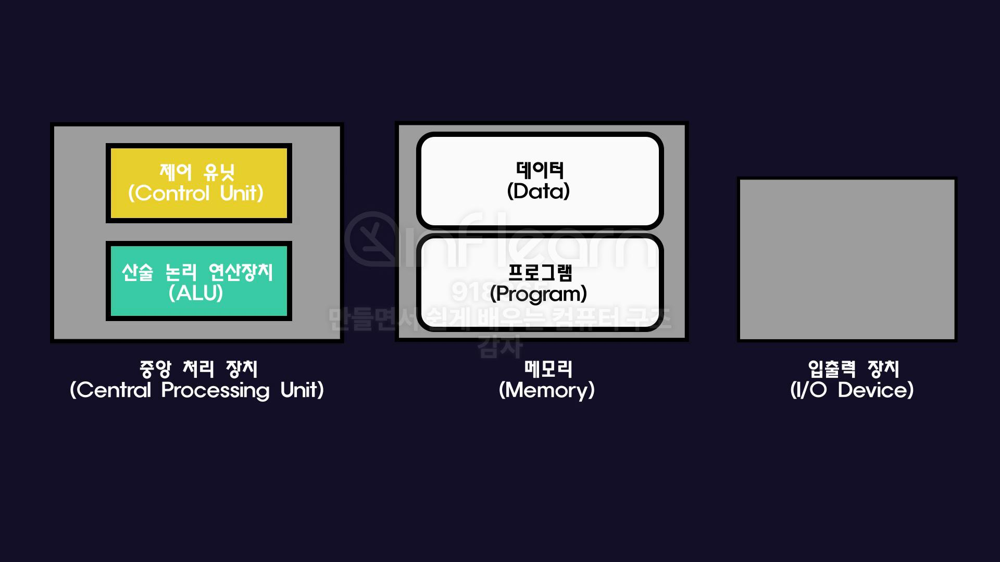
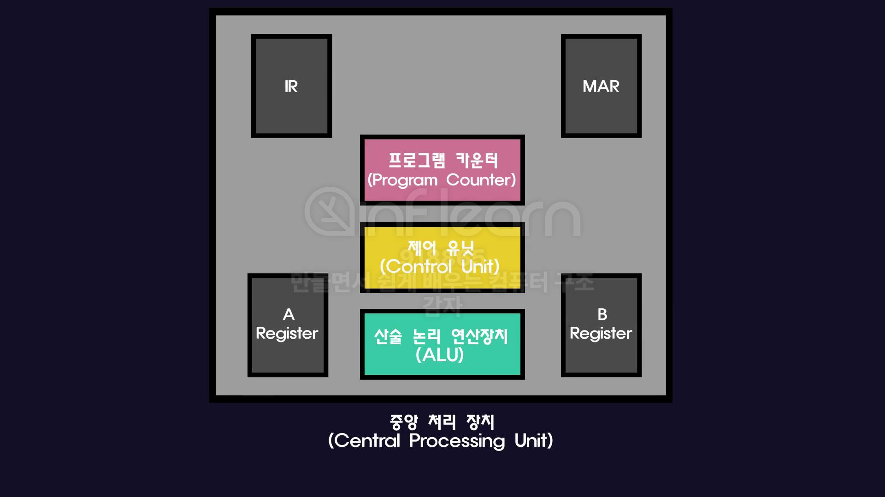
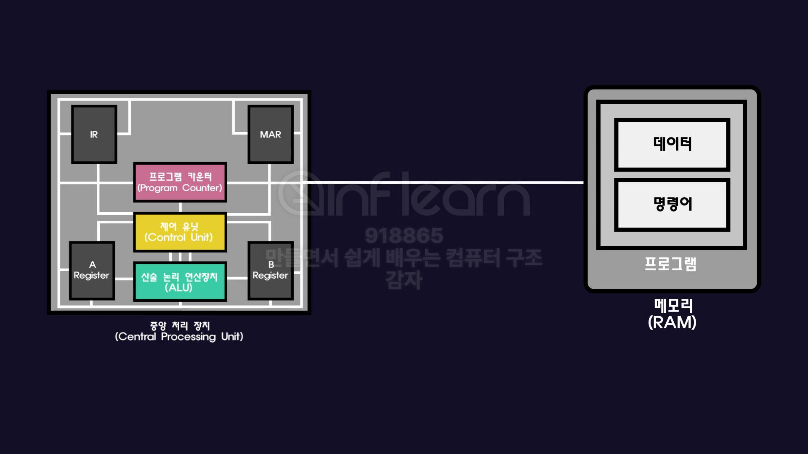
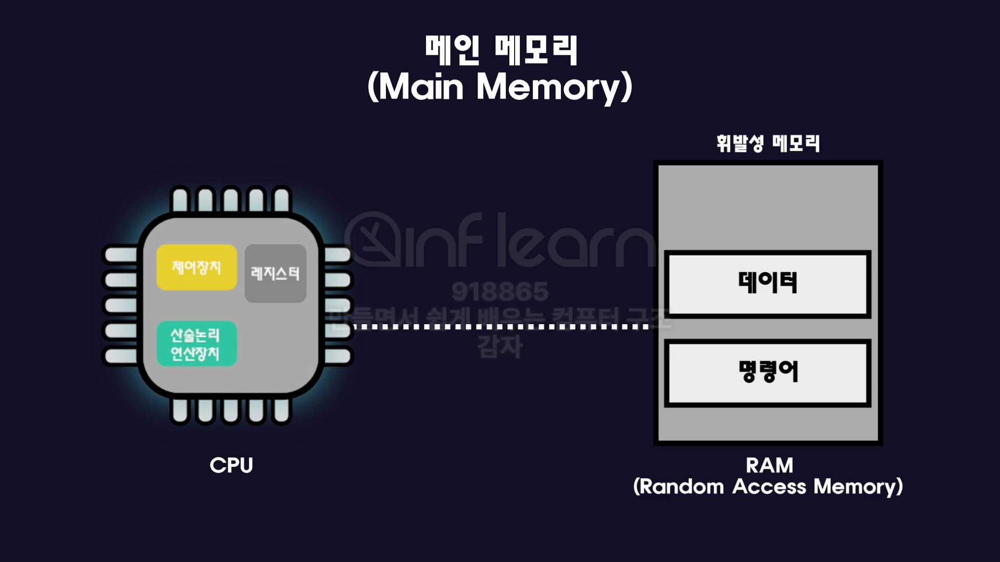
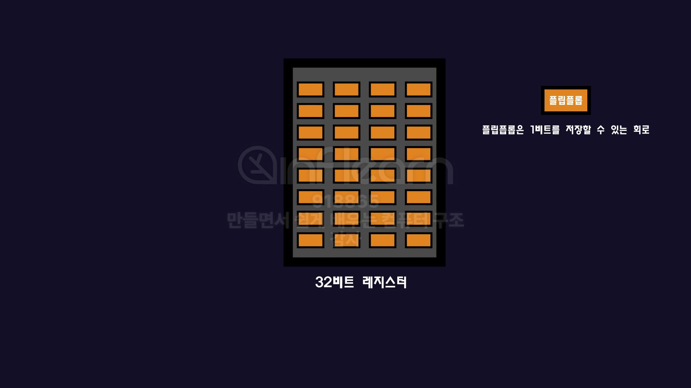

## 1. 중앙 처리 장치(Central Processing Unit)

| 구성 요소 | 역할 |
| --- | --- |
| **ALU (Arithmetic Logic Unit)** | 산술(+, -, *, /) 및 논리 연산(AND, OR, NOT) 수행 |
| **Control Unit (제어장치)** | 명령어 해석 및 실행 제어 |
| **Program Counter (PC)** | 다음에 실행할 명령어의 주소 저장 |
| **레지스터 (Register)** | 가장 작은 단위의 메모리, 초고속 임시 저장소, CPU 내에서 데이터/명령어 저장 및 처리 |
| **버스 (Bus)** | CPU와 메모리/장치 간의 데이터 통로 |

- 메모리에서 **명령어와 데이터**를 가져와 해석하고 연산하여 결과를 저장.
- 이 과정은 **제어장치의 지휘 아래 ALU가 계산**하고, 레지스터에 저장하는 구조로 반복됨.
- CPU의 성능은 주로 클럭 속도(Hz), 명령어 처리 능력, 메모리 접근 속도에 의해 좌우됨.

## 2. 메모리

프로그램 내장 방식: 프로그램의 코드와 데이터는 모두 메모리에 올라가서 실행된다. 프로그램이 변경될 때마다 하드웨어의 연결을 바꿀 필요가 없다. 

### 메인 메모리 (Main Memory)

1. RAM(Random Access Memory)
    - 어떤 데이터에 접근하더라도 접근시간이 동일
    - 휘발성 메모리
    - 프로그램은 비휘발성 보조메모리인 하드디스크나 SSD에 저장해 두고 실행할 때 RAM으로 불러온다.

1. ROM(Read Only Memory)
    - 비휘발성 메모리. 데이터를 영구적으로 저장
    - 한번 저장한 데이터를 수정불가
        - 주로 컴퓨터 부팅을 담당하는 BIOS를 저장하는 용도로 사용

1. 프로그램 코드와 데이터는 SSD/HDD(보조 저장장치)에 저장.
2. 프로그램 실행 시 RAM(메인 메모리)으로 복사.
3. CPU가 RAM에서 데이터를 가져와 레지스터에 저장 후 연산 수행.
4. 결과를 다시 RAM에 저장하거나 출력.

**속도 비교 (빠른 순)**:

레지스터 > 캐시 > RAM > SSD/HDD

- 레지스터는 RAM보다 읽고 쓰는 속도가 빠름으로 자주 사용하는 데이터를 레지스터에 저장하면 효율적이다.
- RAM에서 데이터를 가져오는 시간이 느리기 때문에 성능을 향상 시키기 위해 캐시 메모리를 사용한다.

| 구분 | 특징 |
| --- | --- |
| **RAM (Random Access Memory)** | 휘발성(전원 꺼지면 데이터 사라짐), 읽기/쓰기 가능, 프로그램 실행 시 사용 |
| **ROM (Read Only Memory)** | 비휘발성, 읽기만 가능, 컴퓨터 부팅에 필요한 BIOS 저장 |
| **캐시 (Cache)** | CPU와 RAM 사이의 임시 저장소, 자주 사용하는 데이터 저장 (속도 향상) |

## 3. 주변 장치

1. 입출력 장치(I/O Device)
    - 키보드 마우스 / 모니터 스피커 프린터
2. 보조 메모리 (Secondary Memory)
    - 비휘발성 메모리
    - 메인메모리를 보조하는 메모리다
        - 주로 부족한 용량을 보조
    - 속도는 상대적으로 느리지만 용량이 크다.
    - 하드디스크 SSD
    

## bit

| 단위 | 설명 |
| --- | --- |
| 1비트 (bit) | 0 또는 1 |
| 8비트 = 1바이트 (Byte) | 2⁸ = 256개의 조합 표현 가능 |
| 32비트 레지스터 | 한 번에 4바이트(=32비트) 처리 가능, 최대 4GB(2³²) 주소 공간 |
| 64비트 레지스터 | 한 번에 8바이트(=64비트) 처리 가능, 최대 18EB(2⁶⁴) 주소 공간 |

각 레지스터들은 1bit를 저장할 수 있는 플립플롭이라는 회로로 이루어져 있는데 32개의 플립플롭으로 이루어진 레지스터를 32비트 CPU, 32비트 컴퓨터라고 부른다.

8 플립플롭 = 8비트 레지스터

32 플립플롭 = 32비트 레지스터 = 산술 논리 연산장치가 한 번에 계산하는 단위가 32비트

각 레지스터들은 1bit를 저장할 수 있는 플립플롭이라는 회로로 이루어져 있다.  32개의 플립플롭으로 이루어진 레지스터를 32비트 CPU, 32비트 컴퓨터라고 부른다.

레지스터가 64비트라면 이 데이터를 옮기는 전선(버스)도 64개가 된다. 

- 32비트 CPU: 최대 4GB 메모리만 주소 지정 가능. (32비트 레지스터가 표현할 수 있는 수 = 42억개)
    - 용량이 큰 작업을 하기엔 부족
    - RAM을 여러개 설치해도 레지스터에서 주소를 표현할 수 있는 수가 42억개로 제한되어 있어 4GB 이상은 사용할 수 없다.
- 64비트 CPU: 사실상 메모리 제한 없음 (18엑사바이트 = 1800만 TB!)

**RAM을 아무리 늘려도 프로그램 성능이 크게 좋아지지 않는 이유:**

- 이미 실행 중인 프로그램은 RAM에 다 올라와 있음.
- CPU가 데이터를 처리하는 속도, RAM에서 CPU로 데이터 전달 속도가 더 중요
    - 클럭 속도, 명령어 최적화, 메모리와 레지스터의 속도