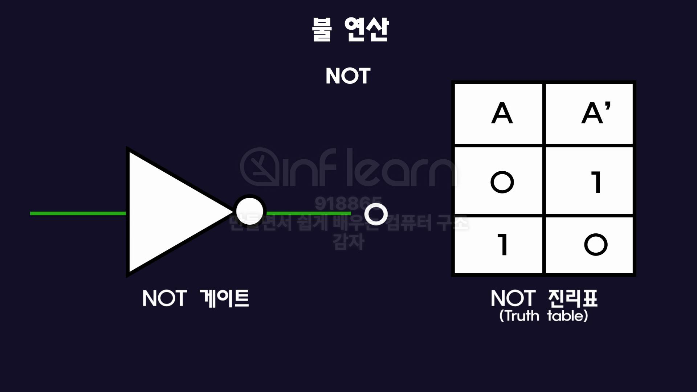
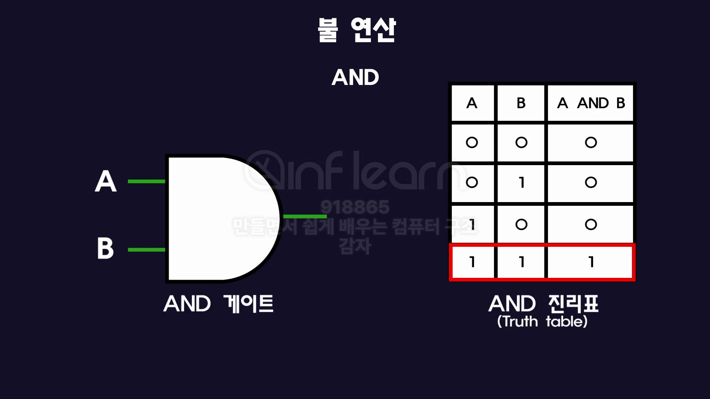
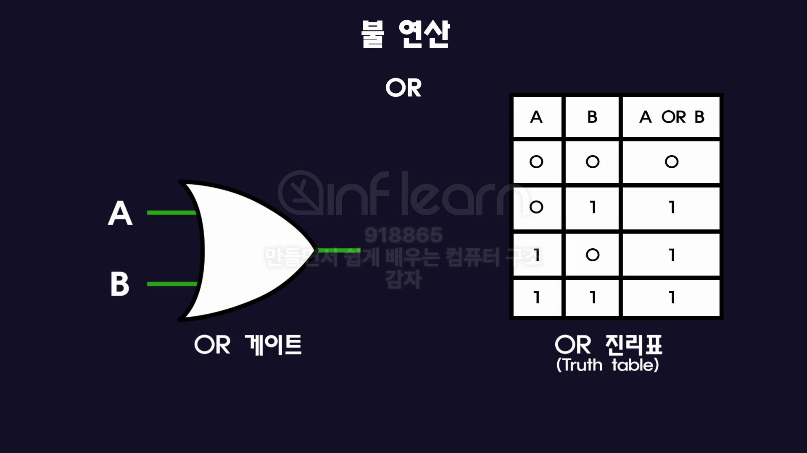
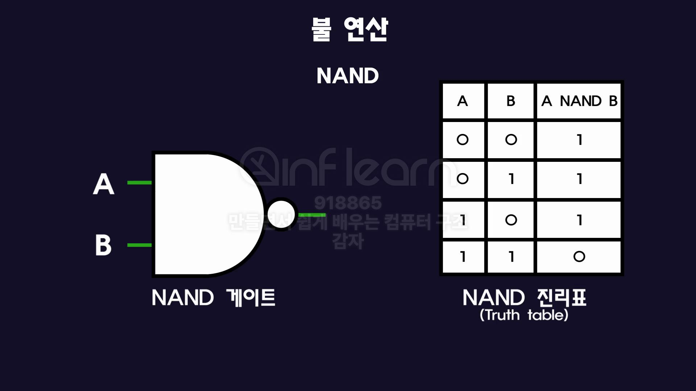
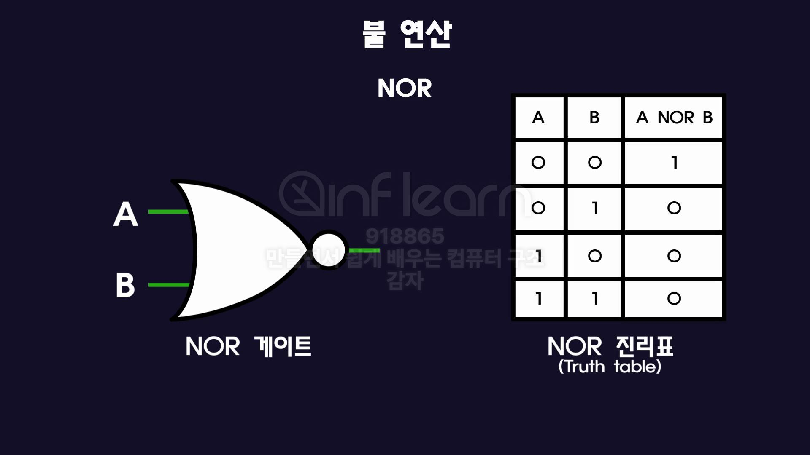
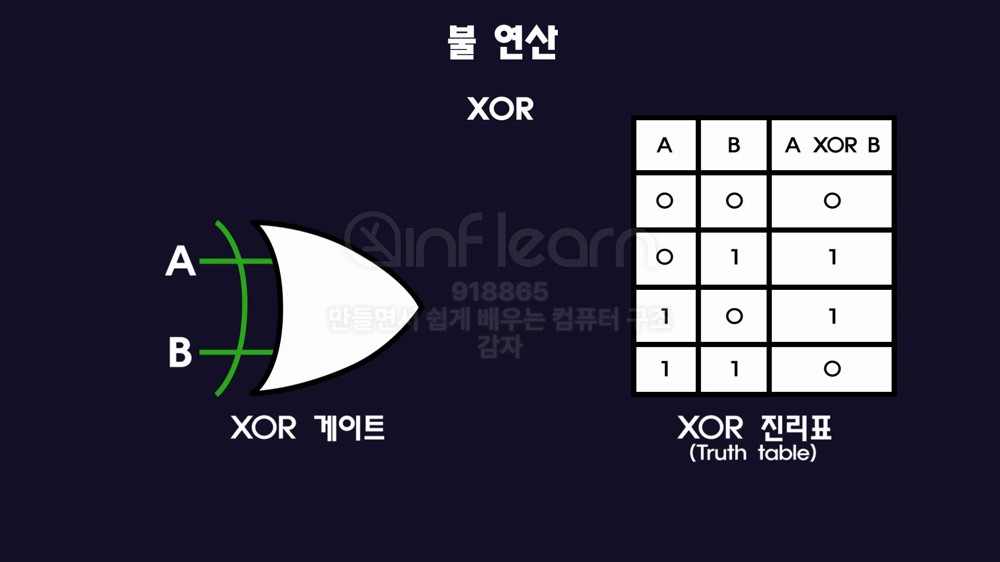
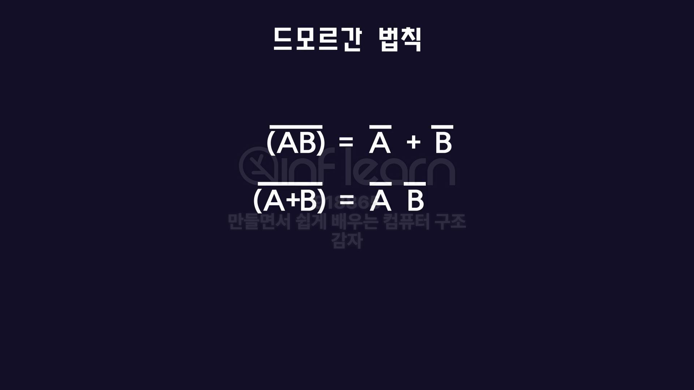
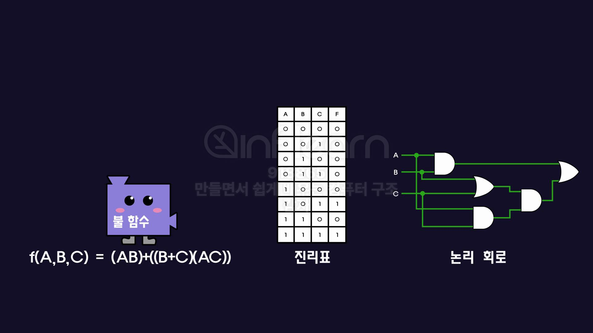
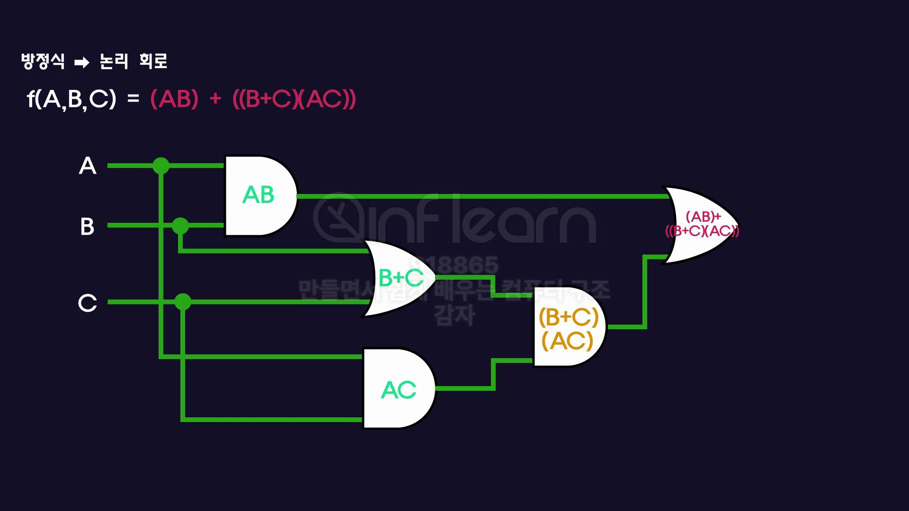
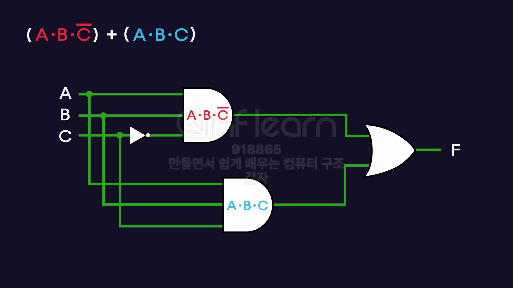

## 불 대수

- **0과 1**의 세계에서 연산하는 대수 체계.
- 디지털 회로의 핵심 이론
- **0과 1로 표현되는 모든 영역**에서 사용.
    - 예: 전자 회로, 컴퓨터 논리, 제어 시스템 등

## 불 연산

논리연산을 불연산이라고 부른다. 입력값에 따른 출력값을 정리한 표를 진리표(Truth Table)라고 한다. 

### 기본 연산

1. **NOT**: 입력 값을 반전시킨다. 
    - A’ Ā 로 표현
    - 1 → 0 | 0 → 1
    
    
    

1. **AND**: 모든 입력 연산자가 1일 때만 1 출력. 그 외는 0
    
    
    
    입력에 대한 출력이 두 입력값을 곱한 것과 같다. 논리곱
    

1. **OR**: 피연산자 중 하나라도 1이면 1이 출력된다. 
    
    
    
    입력에 대한 출력이 두 입력값을 더한 것과 같다. 논리합
    

### 기본 연산

| 연산 | 기호 | 의미 | 진리표 요약 |
| --- | --- | --- | --- |
| **NOT** | A’ | 입력 반전 | 0 → 1, 1 → 0 |
| **AND** | AB | 모두 1일 때만 1 (논리곱) | 1*1=1, 나머지=0 |
| **OR** | A+B | 하나라도 1이면 1 (논리합) | 0+0=0, 나머지=1 |

1. **Nand**: AND 결과에 NOT 연산 수행 AB(-)
    
    
    
2. **NOR**: OR 결과에 NOT 연산 수행 A+B(-)
    
    
    

1. **XOR**: 입력값 중 1일 하나일 때만 1 출력.
    
    
    

### 응용 연산

| 연산 | 기호 | 설명 |
| --- | --- | --- |
| **NAND** | (AB)’ | AND 후 NOT (반전) |
| **NOR** | (A+B)’ | OR 후 NOT (반전) |
| **XOR** | A⊕B | 입력값 중 **하나만 1**일 때 1 출력 |

## 불 대수의 성질과 법칙

**항등원:** 어떤 수 a에 대해 어떤 수를 연산했을 때 처음의 수 a가 되도록 만들어 주는 수

- 덧셈의 0 / 곱셈의 1
- AND(AB) 연산의 항등원은 1 | OR(A+B) 연산의 항등원은 0
    
    A = A * 1 = A + 0
    

1. **교환 법칙**: 피연산자들의 순서를 바꿔도 결과가 같다.
    
    ```
    AND
    	AB = BA
    
    OR
    	A+B = B+A
    
    XOR
    	A⨁B = B⨁A
    ```
    

1. **결합 법칙**: 3개 이상의 항을 연산할 때 어느 두 항을 먼저 계산하더라도 최종 결과가 같다. 
    
    ```
    AND
    	(AB)C = A(BC)
    
    OR
    	(A+B)+C = A+(B+C)
    
    XOR
    	(A⨁B)⨁C = A⨁(B⨁C)
    ```
    
    NAND, NOR, XNOR 연산에는 적용되지 않는다. 
    
    AND, OR, XOR 연산에서만 성립
    
2. **분배 법칙**
    
    ```
    AND
    	A(B+C) = (AB)+(BC)
    
    OR
    	A+(BC) = (A+B)+(A+C)
    
    XOR
    	A(B⨁C) = (AB)⨁(AC)
    ```
    
    NAND, NOR, XNOR 연산에는 적용되지 않는다. 
    

1. **동일 법칙**: AND OR 연산에서 같은 값을 두 번 연산해도 결과가 같다.
    
    ```
    A*A = A
    A+A = A
    ```
    

1. **이중 부정 법칙**: 어떤 변수를 두 번 부정하면 원래 값으로 돌아온다.
    
    ```
    (A')'
    (O)'
    1
    ```
    
2. **흡수 법칙**: 복잡한 법칙이 하나로 흡수된다.
    
    ```
    A(A+B) = A
    	= (AA) + (AB)
    	= (A) + (AB)
    	= (A1) + (AB)
    	= A(1+B)
    	= A(1)
    	= A
    	
    A+(AB) = A
    ```
    

1. 드모르간 법칙
    
    
    

## 불 함수

입력값과 출력값이 **참/거짓(1/0)** 인 함수.



### 1. 방정식 → 진리표

방정식 각 변수에 가능한 모든 값을 대입하여 계산한 결과를 진리표에 기록한다.

### 2. 방정식 → 논리 회로



단순히 연산 우선순위에 따라 각각의 논리 게이트를 연결하기만 하면 된다.

우선순위는 수학의 연산 우선 순위와 비슷하다.

괄호 → NOT → AND → OR 

## 진리표를 변환하는 방법

```
A   B   C   (f)
0   0   0    0
0   0   1    0

```


1. 결과값이 0인 행들은 제외한다.
    
    ```
    A   B   C   (f)
    1   1   0    1
    1   1   1    1
    ```
    
2. 남은 행만 방정식이나 논리행으로 반환한다.
    
    ```
    A   B   C   (f)
    1   1   0    1
    
    F(A, B, C) = ABC(-) = 1*1*1 = 1
    ```
    
3. 같은 행 내에서 모든 입력을 AND 연산으로 연결하여 1이 되도록 한다. 
    
    ```
    A   B   C   (f)
    1   1   0    1
    
    - C에 NOT 연산을 하면 성립
    
    F(A, B, C) = ABC(-) = 1*1*1 = 1
    ```
    
    ```
    A   B   C   (f)
    1   1   1    1
    
    F(A, B, C) = ABC = 1*1*1 = 1
    ```
    
4. 모든 행을 방정식으로 만든 후 각 행을 OR 연산으로 묶어준다.

1. 왼쪽 방정식에 해당하는 논리 회로를 구성한 후 오른쪽 방정식에 해당하는 논리 회로를 연결한다. 
    
    
    
2. 불 대수의 법칙들을 활용해서 방식을 간단하게 정리할 수 있다. 
    
    ```
    (ABC(-)) + (ABC)
    	= AB(C(-)+C)
    	= AB*(1)
    	= AB
    ```