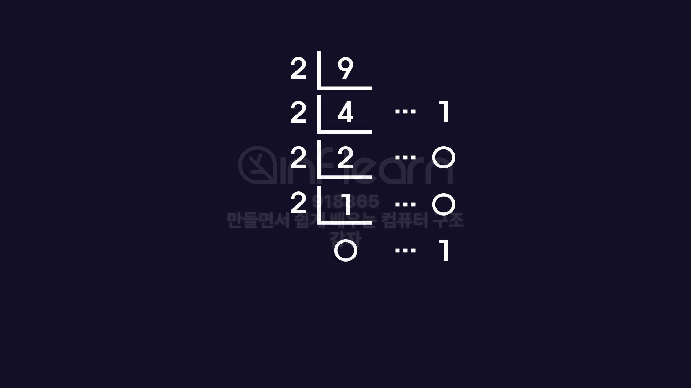
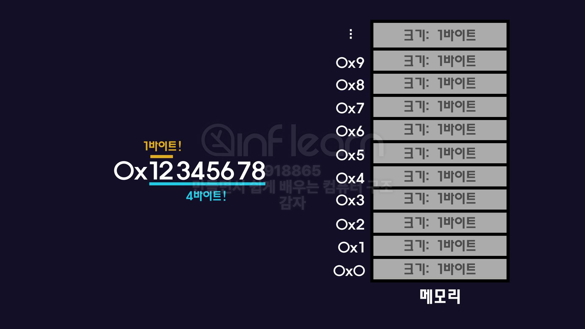

## 10진법과 2진법

| 항목 | 설명 |
| --- | --- |
| **10진법** | 한 자리 숫자가 0~9까지 총 10개의 숫자를 사용각 자리수의 가중치는 10ⁿ |
| **2진법** | 컴퓨터에서 사용하는 수 체계각 자리수는 0 또는 1, 가중치는 2ⁿ |

컴퓨터는 비트로 수를 표현하기 때문에 2진법을 사용한다.

- 1비트로 표현할 수 있는 개수는 2^1 = 2개
- 2비트로 표현할 수 있는 개수는 2^2 = 4개

```java
1101
	= 2^3 + 2^2 + 2^1 + 2^0 
	= 8 + 4 + 0 + 1
	= 13
```

## 10진수를 2진수로 변환하기

10진수를 2로 나눌 수 없을 때까지 나눈 후 나머지를 역순으로 읽는다.



## 16진법

| 항목 | 설명 |
| --- | --- |
| **목적** | 2진수를 간단하게 표현하기 위해 사용 |
| **표기법** | `0x` 접두사 사용, 09, A~F (총 16개 문자) |
| **변환 규칙** | 1자리 16진수 = 4자리 2진수 |

```java
14(10) = 1110(2) = E(16)
245(10) = 11110101(2) = F5(16)
123(10) = 01111011(2) = 7B(16)

ob1001 = 1001(2)

ox1001 = 1001(16)
```

## 빅 엔디안과 리틀 엔디안

| 구분 | 설명 |
| --- | --- |
| **Big Endian** | 가장 큰 바이트(상위 비트)를 가장 낮은 주소에 저장 |
| **Little Endian** | 가장 작은 바이트(하위 비트)를 가장 낮은 주소에 저장 |

📌 반드시 시스템에서 하나의 방식으로 통일해야 데이터 해석 오류 없음



한 공간의 크기가 1바이트 단위로 나눠진 메모리가 있다고 하자.

ox12345678 16진수는 한자릿수가 4비트이므로 두자리가 1바이트가 뒤고 한 번에 저장할 수 없으므로 메모리 4개를 이용해야 한다.

1. MSB
    
    가장 큰 자릿수를 낮은 번지의 주소에 먼저 채운다.
    
2. LSB
    
    가장 작은 자릿수를 낮은 번지의 주소에 먼저 채운다.
    

## 오버플로우와 인터럽트

### 🧨 오버플로우 (Overflow)

- 표현 가능한 비트 수를 넘는 값을 연산하려 할 때 발생
- 예: 8비트 → 최대값 `255(10)` → `256`은 표현 불가

### ⏰ 인터럽트 (Interrupt)

- CPU가 **예외 상황을 감지**하고 현재 작업 중단
    - 인터럽트 서비스 루틴을 통해 인터럽트로 인해 기존 동작이 중단되고 인터럽트 서비스 루틴이 실행된 후에는 원래 수행하던 동작을 재개한다.
- 오버플로우, 입출력 신호, 타이머 등으로 발생

| 유형 | 설명 |
| --- | --- |
| **외부 인터럽트** | 입출력 장치, 전원 등 외부 요소 |
| **내부 인터럽트** | 오버플로우, 0으로 나누기 등 내부 연산 오류 |

## 음수

컴퓨터는 2의 보수법을 사용해 음수를 표현한다. (뺄셈도)

1. 양수의 2진수 → **비트 반전**
2. 그 결과에 **1을 더함**

```
7 = 0111
	1. 비트 반전 = 1000
	2. 반전에 1을 더함 = 1001

0000 ~ 1111 = 0~15 16개의 값, 부호 없는 정수(양수만 표현 가능)
0000 ~ 1111 = -8~7 16개의 값, 부호 없는 정수(양수, 음수 표현 가능)

MSB가 0이면 양수, 1이면 음수를 의미
4비트를 사용할 때의 MSB는 부호 표현에 사용되므로 
실제 수를 표현하는 데는 3비트만 사용할 수 있다. 
```

❗ MSB가 1이라고 무조건 음수는 아니다.