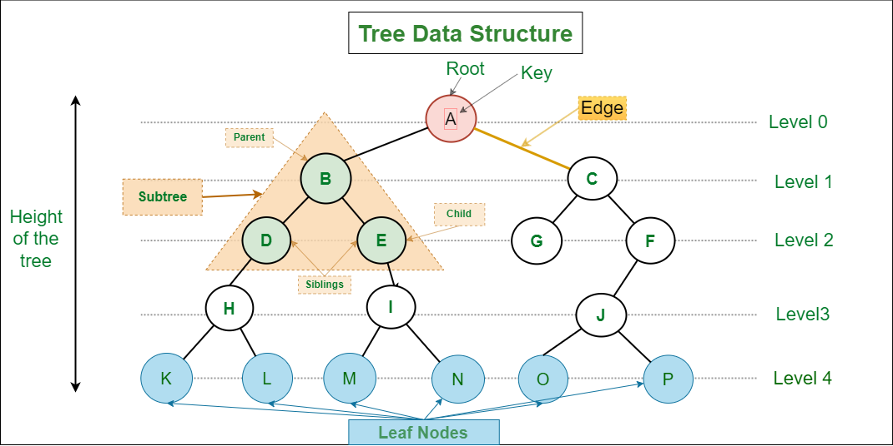
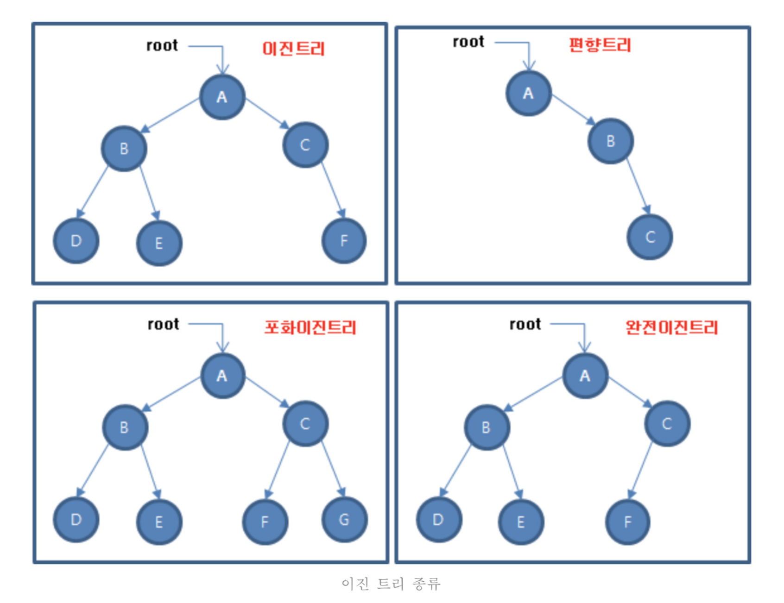

# 트리와 이진 트리

## 🌳 트리구조

트리는 **계층적 구조**를 표현하기에 적합한 자료구조로, **조직도**, **디렉토리** 구조처럼 **하나의 루트(root)**에서 **나뭇가지가 뻗어나가듯** 내려가는 형태를 가진다.

---

### 🌲 이진 트리 (Binary Tree)

**계층적 구조**를 표현하기에 적합한 자료구조로, **조직도**, **디렉토리** 구조처럼 하나의 루트(root)에서 **나뭇가지가 뻗어나가듯** 내려가는 형태

### 🌲 이진 트리 (Binary Tree)

각 노드가 **최대 두 개의 자식 노드**를 가질 수 있는 트리

**🌳 포화 이진 트리 (Full Binary Tree)**

- 트리의 **모든 레벨**에 노드가 꽉 차 있고, **모든 리프 노드가 같은 레벨**에 있는 트리
- 더 이상 노드를 추가할 수 없는 상태의 트리  (트리의 높이를 유지하면서 추가 불가)
- 1번 그림은 높이가 3인데, 아직 새 노드를 추가할 수 있는 자리(리프 노드)가 있으므로 **포화 이진 트리가 아니다.**

**🌳 완전 이진 트리 (Complete Binary Tree)**

- 마지막 레벨을 제외한 **모든 레벨이 꽉 차 있으며**,  마지막 레벨의 노드는 **왼쪽부터 채워진** 트리
- 마지막 레벨(leaf level)만 비어있을 수 있고, 왼쪽부터 차례대로 노드가 채워져야 함
- 1번 그림은 최대 레벨(레벨 3)에서 **왼쪽부터 노드가 채워지지 않았기 때문에**, **완전 이진 트리가 아니다.**