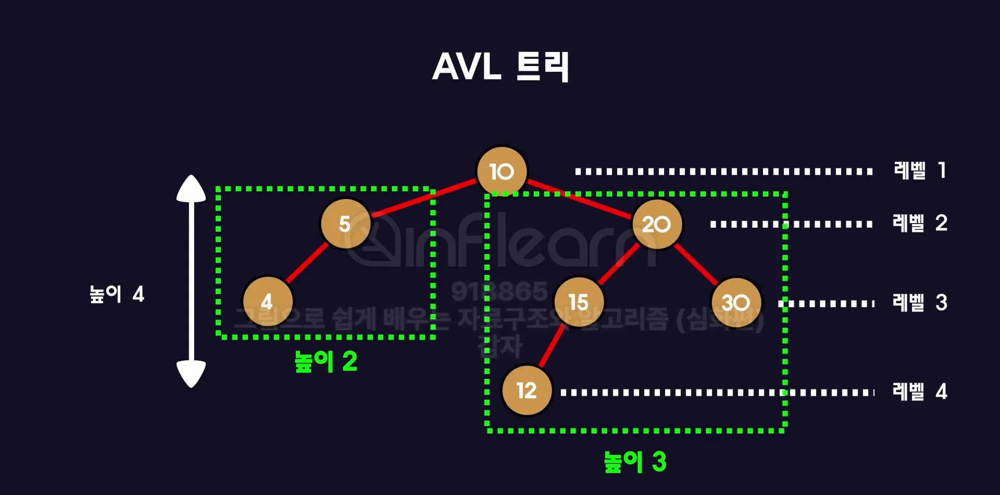

## 🌳 AVL Tree

- 일반 이진 탐색 트리(BST)는 **편향**될 경우, 시간 복잡도가 `O(N)`까지 증가.
- 균형을 유지하면 검색, 삽입, 삭제 모두 `O(logN)`의 성능을 보장.
- **AVL Tree**는 이를 위해 고안된 자료구조로, **모든 노드에 대해 왼쪽과 오른쪽 서브트리 높이 차이가 최대 1**이어야 함.

### 균형 조건

트리의 균형을 유지하기 위해서는 균형이 맞는지 맞지 않는지 구분할 수 있어야 한다. 

- 왼쪽 자식트리의 높이와 오른쪽 자식트리의 높이가 최대 1만큼 차이 나도록 허용하고 이보다 더 차이가 난다면 균형이 무너졌다고 판단한다.
- 이 규칙을 트리의 모든 트리에 적용해서 균형이 하나라도 무너진 트리가 있다면 균형이 무너진 트리로 판단한다.
    
    
    
    왼쪽 서브트리 2 - 오른쪽 서브트리 3 = -1 
    
    ⇒ 균형이 맞는 이진 트리
    
    
    
    왼쪽 서브트리 2 - 오른쪽 서브트리 0 = 2
    
    ⇒ 균형이 깨진 이진 트리
    

### 회전 종류

| 불균형 유형 | 해결 방법 (회전) | 설명 |
| --- | --- | --- |
| LL (Left-Left) | 오른쪽 회전 (Right Rotation) | 왼쪽 서브트리의 왼쪽 서브트리가 높음 |
| RR (Right-Right) | 왼쪽 회전 (Left Rotation) | 오른쪽 서브트리의 오른쪽 서브트리가 높음 |
| LR (Left-Right) | 왼쪽 회전 + 오른쪽 회전 (Left + Right) | 왼쪽 서브트리의 오른쪽 서브트리가 높음 |
| RL (Right-Left) | 오른쪽 회전 + 왼쪽 회전 (Right + Left) | 오른쪽 서브트리의 왼쪽 서브트리가 높음 |
1. **LL 회전 (Right Rotation)**
    
    ```
    Before LL
        z
         \
          y
           \
            x
            
    After LL
          y
         / \
        z   x
    
    ```
    

1. **RR 회전 (Left Rotation)**
    
    ```
    Before RR
            z
           /
          y
         /
        x
    
    After RR 
          y
         / \
        x   z
    ```
    

1. **LR 회전(Left Right Rotation)**
    
    ```
    Before LR
    1.
            z
           /
          y
           \
            x
           
     2.
            z
           /
          x
         /
        y
    
    After LR 
          x
         / \
        y   z
    ```
    

1. **RL 회전(Right Left Rotation)**
    
    ```
    Before RL (불균형 상태):
     1.
        z
         \
          y
         /
        x
      
     2.
        z
         \
          x
           \
            y   
        
    
    After RL
          x
         / \
        z   y
    ```