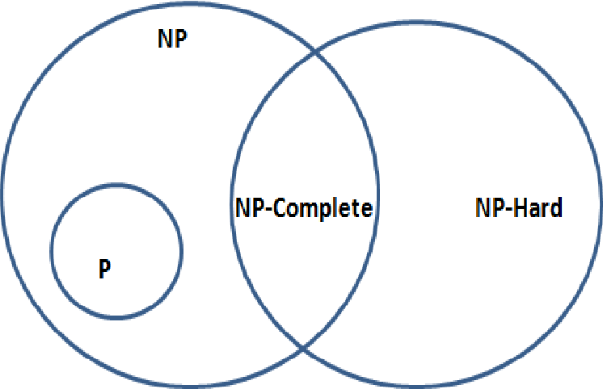
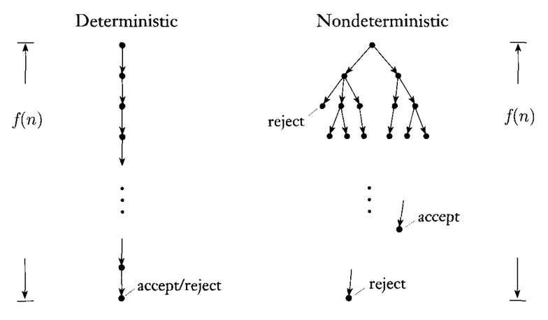

P-NP 문제는 **어떤 문제의 난이도**를 파악하고, **해결 가능성**을 평가하는 중요한 기준이다.

이름: 심민경
참여 계기: 기본을 더 탄탄하게 다지기 위해서 참여신청했습니다.
러너들에게 한 마디: 화이팅!

### 🔷 결정 문제 (Decision Problem)

- **정의**: 주어진 문제에 대해 예/아니오(참/거짓)으로만 대답할 수 있는 문제.
- **예시**:
    - "2는 10보다 작다?" → 예
    - "이 그래프에 해밀턴 경로가 있는가?" → 예/아니오
- **특징**:
    - P와 NP 문제는 모두 결정 문제를 기반으로 다룬다.
    - 최적화 문제도 결정 문제로 변환 가능하다.
    

### 🔷 최적화 문제 (Optimization Problem)

- **정의**: 주어진 조건에서 최적의 해(가장 좋은 답)을 찾는 문제.
- **예시**:
    - A 지점에서 E 지점까지 가는 가장 짧은 경로 구하기 (최단 경로 문제)
    - 외판원 문제 (TSP): 여러 도시를 최소 거리로 순회하는 경로 찾기
- **특징**:
    - 대부분의 최적화 문제는 결정 문제로 바꿀 수 있다.
        - "경로의 길이가 100 이하인가?" → 결정 문제
    - 어떤 상황이 주어지고 거기서 최적의 해를 찾는 문제

## 🔷 P 문제 (Polynomial Time)

- **정의**: 결정 문제가 결정론적 튜링 머신(DTM)으로 다항 시간 내 해결 가능한 문제
    - **결정론적 튜링 머신(DTM)**:
        - 현재 상태에서 다음 상태로의 이동이 **유일하게 결정**되는 머신 (오늘날의 컴퓨터 모델)
    - **다항 시간(Polynomial Time)**:
        - 알고리즘의 실행 시간이 n^k 형태로 표현되는 시간.
        - 상수 시간(O(1)), 로그 시간(O(log n))도 다항 시간에 포함.
- **예시**:
    - 정렬 문제 (버블 정렬, 합병 정렬 등)
    - 덧셈, 곱셈, 나눗셈 등의 산술 계산

## 🔷 NP 문제 (Nondeterministic Polynomial Time)

- **정의**: 결정 문제가 비결정론적 튜링 머신(NTM)으로 다항 시간 내 해결 가능한 문제.
    - **비결정론적 튜링 머신(NTM)**:
        - 현재 상태에서 여러 개의 선택지가 존재, **모든 경로를 동시에 탐색**할 수 있는 상상의 기계.
    - 힌트(후보 해)를 받으면, 그 해답이 맞는지 다항 시간 내에 검증 가능
- **특징**:
    - 현재 상태에서 다음 상태로 이동할 때 다음 상태의 갯수가 유일하지 않은 머신
    - 결정론적 튜링 머신으로는 지수 시간(2ⁿ)이 걸릴 수 있는 문제들이 많음.
        - n이 조금만 커져도 해결하는 시간이 매우 오래 걸리기 때문에 현실적으로 결정론적 튜링 머신으로는 해결하기 힘들다.
    - 모든 P 문제는 NP 문제에 포함된다. (P ⊆ NP)
        - 모든 P 문제를 비 결정론적 튜링 머신을 사용해 다항 시간 내에 답을 구할 수 있다.
- **예시**: 해결이 가능한지, 가능하지 않은지 판별나지 않은 문제
    - 외판원 문제(TSP): "길이가 100 이하인 경로가 있는가?"
    - 해밀턴 경로 문제: "모든 정점을 정확히 한 번씩 방문하는 경로가 있는가?"

## 🔷 NP-hard 문제

- **정의**:
    - 모든 NP 문제를 다항 시간 내에 **문제(A)로 환원**할 수 있는 문제
        - 환원: 모든 NP 문제를 하나의 문제로 바꿔서 해결할 수 있다면 다른 모든 문제가 해결되는 문제
- **특징**:
    - NP-hard 문제 하나를 풀 수 있으면 **모든 NP 문제도 풀 수 있음**
    - 반드시 NP에 속할 필요는 없다.
- **예시**:
    - 외판원 문제(TSP, 최적화 버전)
    - 3-SAT (논리식 만족 문제)
    

## 🔷 NP-complete 문제

- **정의**:
    - **NP-hard**이면서, 동시에 **NP**에 속하는 문제.
- **특징**:
    - NP 문제 중에서도 **가장 어려운 문제**에 해당.
    - NP-complete 문제 중 하나라도 P로 풀린다면, **모든 NP 문제도 P로 풀 수 있다.**
- **예시**:
    - 외판원 문제(TSP)의 결정 문제: "100 이하의 경로가 존재하는가?"
    - 해밀턴 경로 문제: "해밀턴 경로가 존재하는가?"
    

## 🔷

| 구분 | 정의 |
| --- | --- |
| P | 결정 문제를 다항 시간 내에 풀 수 있는 문제 |
| NP | 답(힌트)을 주어지면 다항 시간 내에 검증 가능한 문제 |
| NP-hard | 모든 NP 문제로부터 다항 시간 내에 환원 가능한 문제 |
| NP-complete | NP-hard + NP인 문제 |